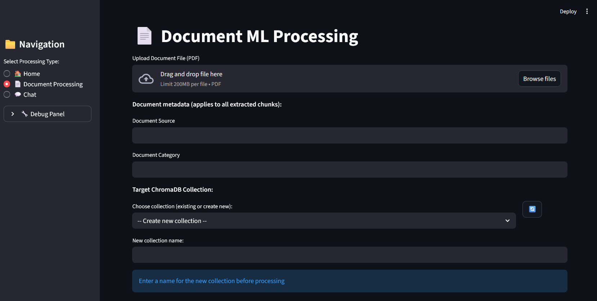
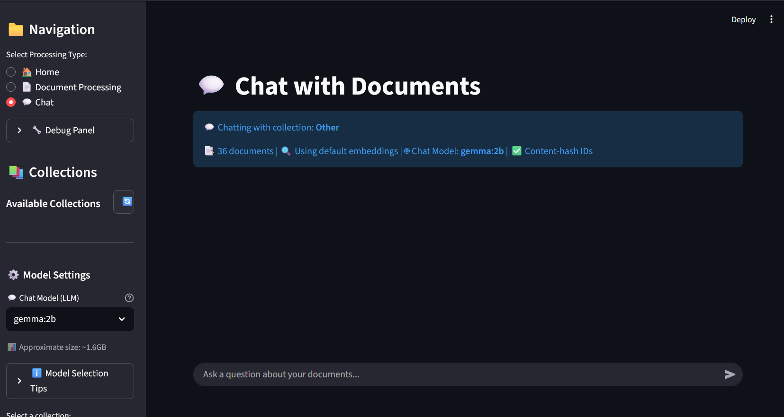

# Agentic RAG Workshop

A lightweight Retrieval-Augmented Generation (RAG) demo for local document and audio Q&A:

- **Fast Setup**: Uses Streamlit for the UI and runs completely locally
- **Flexible Storage**: Uses ChromaDB for vector storage (with in-memory fallback)
- **LLM**: Ollama only for local chat and embeddings
- **Agentic RAG**: Chat agent can search your docs multiple times before answering (when the model supports tools; otherwise single-shot RAG)
- **Smart Chunking**: The agent has full autonomy over sampling: for documents it decides how many pages to sample; for audio/video transcripts it decides how many characters to sample. Then the LLM picks chunk size, separators, and style from that sample. Fixed/recursive and table-aware strategies supported.
- **Audio Transcription**: Process audio/video (meetings, podcasts) and add transcriptions to your knowledge base

Process your PDF documents and audio files, manage multiple collections, and chat with your content using retrieval-augmented generation — all running locally on your machine.

This README provides step-by-step setup for **Windows (PowerShell)** and **macOS (Terminal)** with troubleshooting tips.

Documentation in this repo
--------------------------
| File | Description |
|------|-------------|
| **README.md** (this file) | Full setup, usage, and reference |
| **COMMANDS.md** | Quick command reference (install, run, audio) |
| **AUDIO_GUIDE.md** | Audio processing guide |
| **AUDIO_EXAMPLES.md** | Audio usage examples |
| **AUDIO_FEATURE_SUMMARY.md** | Audio feature overview |
| **requirements.txt** | Python dependencies |

Requirements
------------
- Python 3.10 or newer
- Pre-req: ChromaDB installed and configured if you want persistent vector storage
- Pre-req: Ollama installed and models available if you want Ollama embeddings/LLM locally
- **Windows**: PowerShell (examples below use PowerShell)
- **macOS**: Terminal; Homebrew recommended for ffmpeg (`brew install ffmpeg`)

Quick start (macOS / Linux)
---------------------------
1. Clone the repo and go into the project directory:

```bash
git clone https://github.com/YOUR_USERNAME/Agentic-RAG.git
cd Agentic-RAG
```

2. Create and activate a virtual environment (recommended):

```bash
python3 -m venv .venv
source .venv/bin/activate
```

3. Install Python dependencies:

```bash
pip install -r requirements.txt
```

4. (Optional) Install ffmpeg for full audio support (MP3, M4A, etc.):

```bash
brew install ffmpeg
```

5. ChromaDB and Ollama: ChromaDB is in requirements. For Ollama, install from https://ollama.ai and pull a model (e.g. `ollama pull phi`). Then run the app:

```bash
streamlit run localragdemo.py
```

Quick start (Windows PowerShell)
--------------------------------
1. Clone the repo and go into the project directory:

```powershell
git clone https://github.com/YOUR_USERNAME/Agentic-RAG.git
cd Agentic-RAG
```

2. Create and activate a virtual environment (recommended):

```powershell
python -m venv .venv
.\.venv\Scripts\Activate.ps1
```

3. Install Python dependencies:

```powershell
pip install -r requirements.txt
# (If you didn't include streamlit in requirements) pip install streamlit
```

4. Install and configure ChromaDB for persistent collections:

- If you want to persist collections to disk instead of the in-memory fallback, install `chromadb` in your environment. See https://www.trychroma.com/docs for installation steps. The app uses the `CHROMA_PATH` environment variable to determine where to store the DB.

**Important: ChromaDB Directory**
- When you process your first document, a `chroma_db/` directory will be created automatically in your project root
- This directory stores your vector embeddings and indexed document chunks
- The directory is excluded from git (see `.gitignore`) to keep your repository clean
- **Do not delete this directory** if you want to keep your processed documents and collections
- Location: By default `./chroma_db`, or set via `CHROMA_PATH` environment variable
- Each collection within this directory can contain thousands of document chunks with their embeddings

Example (pip):

```powershell
pip install chromadb
```

5. Install and configure Ollama if you want high-quality local embeddings/LLM:

- Ollama requires native installation (https://ollama.ai). After installing the Ollama runtime, install the Python package and pull a model.

Example (Python package + using a local Ollama server):

```powershell
pip install ollama
# Follow Ollama docs to install the server/daemon and download a model
# e.g. ollama pull <model-name>
```

Run the Streamlit app
----------------------
From the project directory (with the venv active) run:

**macOS / Linux:**
```bash
streamlit run localragdemo.py
```

**Windows:**
```powershell
streamlit run localragdemo.py
```

This opens the Streamlit UI in your browser. The app has three main sections:

Using Audio Processing (NEW!)
----------------------------
The Audio Processing page allows you to transcribe audio files and add them to your knowledge base:

1. **Install Audio Dependencies**:
   Before using audio processing, install the required libraries:
   ```powershell
   pip install SpeechRecognition pydub
   ```
   
   **Important**: PyDub requires FFmpeg to be installed on your system:
   - Download FFmpeg from https://ffmpeg.org/download.html
   - For Windows: Download the build, extract, and add the `bin` folder to your PATH
   - For macOS: `brew install ffmpeg`
   - For Linux: `sudo apt-get install ffmpeg`

2. **Supported Audio Formats**:
   - WAV (always supported)
   - MP3, M4A, OGG, FLAC (requires pydub and ffmpeg)

3. **Upload Audio File**:
   - Click "Upload Audio File" and select your audio
   - The app will show a preview player and file info
   - Supported: meetings, podcasts, interviews, lectures, etc.

4. **Transcription Settings**:
   - **Language**: Select the language spoken in the audio (10+ languages supported)
   - **Split long audio**: Automatically splits audio files longer than 60 seconds for better transcription accuracy

5. **Add Metadata** (optional but recommended):
   - **Audio Source**: e.g., "Team Meeting 2025-01-15"
   - **Audio Category**: e.g., "Business Meeting", "Education", "News"
   - **Speaker/Host**: Name of the speaker or meeting host
   - This metadata helps organize and filter transcriptions later

6. **Choose Your Collection**:
   - Works exactly like Document Processing
   - Add to existing collections or create new ones
   - You can mix document and audio content in the same collection!

7. **Process the Audio**:
   - Click "Transcribe and Process Audio"
   - The app will:
     1. Convert audio to WAV format if needed
     2. Split into manageable chunks (if enabled)
     3. Transcribe each chunk using Google Speech Recognition
     4. Display the full transcription
     5. **Agent decides how much of the transcript to sample** (full autonomy)
     6. **Agent chooses chunk size and separators** from that sample
     7. Store in ChromaDB with metadata
   - Watch the progress bar for transcription and storage
   - Preview the transcription and text chunks
   - Use "Go to Chat" to ask questions about the audio content

8. **Tips for Best Results**:
   - Use clear audio with minimal background noise
   - For long recordings (>5 minutes), enable audio splitting
   - For multi-speaker content, consider processing shorter segments
   - Check the transcription preview before storing to verify accuracy
   - If transcription fails, try improving audio quality or reducing background noise

**Privacy Note**: Audio transcription uses Google's free Speech Recognition API, which requires an internet connection. The audio is sent to Google for processing. If you need offline transcription, consider integrating Whisper or other local models.

Using Document Processing
------------------------
The Document Processing page is where you add documents to your knowledge base:

1. **Upload a PDF**:
   - Click "Upload Document File (PDF)" to select your file
   - The app will extract text from all pages

2. **Add Metadata** (optional):
   - Document Source: e.g., "Company Handbook 2025"
   - Document Category: e.g., "HR Policies"
   - This metadata is attached to every chunk from this document

3. **Choose Your Collection**:
   The dropdown shows available collections and lets you create new ones:
   - Select an existing collection to add documents to it
   - Choose "-- Create new collection --" to start a fresh one
   - Collection names must be 1-64 characters using only letters, numbers, hyphens, and underscores
   - Use the 🔄 refresh button to update the list

4. **Process the Document**:
   - Click "Extract Text and Process Document"
   - **The agent first decides how many pages to sample** (full autonomy—no fixed page count), then chooses chunk size, separators, and style from that sample
   - Watch the progress bar as chunks are processed
   - When done, you'll see a preview of the first few chunks
   - Use "Go to Chat" to start asking questions, or "Clear & Upload Another" to add more documents

Screenshots & demo
------------------
Below are example screenshots of the app pages. Replace these placeholder images in `assets/` with real screenshots or an animated GIF to create a short demo.

Document Processing (example):



Chat page (example):




Using Chat
----------
The Chat page is where you interact with your indexed documents and audio transcriptions:

1. **Select a Collection**:
   - Choose from your existing collections in the sidebar
   - Collections can contain documents, audio transcriptions, or both!
   - Each collection shows its document count and embedding type
   - Use the 🔄 refresh button to update the list
   - Click 📊 Details to see collection info
   - The 🗑️ Delete button lets you remove collections (requires confirmation)

2. **Ask Questions**:
   - Type your question in the chat input
   - The app works with both document and audio content seamlessly
   - Examples:
     - "What did we discuss in the team meeting?"
     - "Summarize the key points from the presentation"
     - "What policies are mentioned in the handbook?"
   - The app will:
     1. Search for relevant document/audio chunks
     2. Use those chunks as context
     3. Generate an answer using your local LLM

3. **Chat History**:
   - Your conversation is preserved in the current session
   - Use "Clear Chat History" to start fresh

4. **Model Selection** (New!):
   - Use the "⚙️ Model Settings" panel in the sidebar
   - Select from CPU-friendly models to avoid GPU/memory errors
   - **Recommended models:**
     - **For low memory systems (< 2GB)**: tinyllama, phi, qwen2:1.5b
     - **For balanced performance (2-4GB)**: gemma:2b, llama3.2:3b
     - **For better quality (4GB+)**: mistral, llama3.1:8b
   - Each model shows its approximate size
   - Your selection is saved for the current session
   - The active model is displayed in the chat interface
   - **Tip**: If you get memory errors, immediately switch to a smaller model!

Model Selection Guide
--------------------
The app now includes an easy-to-use model selector to help prevent GPU/memory errors:

**Where to Find It**
- Open the **Chat** page
- Look for **"⚙️ Model Settings"** in the sidebar (below Collections)
- Select your preferred model from the dropdown

**Available Models (sorted by size)**
1. **tinyllama** (~600MB) - Smallest, fastest, lowest memory usage *
2. **phi** (~1.6GB) - Microsoft's efficient small model *
3. **gemma:2b** (~1.6GB) - Google's compact model *
4. **qwen2:1.5b** (~900MB) - Qwen's lightweight model *
5. **llama3.2:1b** (~1.3GB) - Meta's small Llama variant *
6. **llama3.2:3b** (~2GB) - Balanced size/quality *
7. **gemma2:2b** (~1.6GB) - Updated Gemma model *
8. **mistral** (~4GB) - Higher quality, needs more RAM *
9. **llama3.1:8b** (~4.7GB) - Best quality, requires significant RAM *

**How to Choose**
- **Start small**: Begin with tinyllama or phi
- **If you have issues**: Switch to a smaller model
- **For better answers**: Gradually try larger models if your system can handle them
- **Monitor your system**: Watch Task Manager/Activity Monitor for memory usage

**Tips for Avoiding Memory Errors**
- Close other applications before running larger models
- Start with the smallest model and work your way up
- The model selector remembers your choice within a session
- If you see "GPU error" or "memory error", immediately select a smaller model
- Different documents may work better with different models - experiment!

**Model Performance vs. Size Trade-off**
- Smaller models (< 2GB): Fast responses, may be less accurate on complex questions
- Medium models (2-4GB): Good balance of speed and quality
- Larger models (4GB+): Best answers, but slower and require more RAM

Data Storage & ChromaDB Directory
---------------------------------
Understanding where your data is stored and how it's managed:

**Automatic Creation**
- The `chroma_db/` directory is created automatically when you process your first document
- No manual setup required - just upload a PDF and start processing
- Default location: `./chroma_db` in your project root

**What's Stored**
- **Vector Embeddings**: Mathematical representations of your document chunks
- **Document Text**: Original text chunks from your processed documents
- **Metadata**: Document source, category, and other custom metadata
- **Collections**: Each collection is stored as a separate subfolder
- **Index Files**: ChromaDB's internal index structures for fast retrieval

**Important Notes**
- ✅ **Git Ignored**: The directory is automatically excluded from git version control
- ⚠️ **Don't Delete**: Removing this directory will delete all your processed documents and embeddings
- 💾 **Backup**: Consider backing up this directory if you've processed important documents
- 🔒 **Privacy**: All data stays local on your machine - nothing is sent to external servers
- 📦 **Size**: Directory size grows with the number of documents (typically a few MB per collection)

**Customizing the Location**
Set the `CHROMA_PATH` environment variable to store the database elsewhere:

**Windows (PowerShell):**
```powershell
$env:CHROMA_PATH = "D:\MyData\vector_db"
streamlit run localragdemo.py
```

**macOS / Linux:**
```bash
export CHROMA_PATH="$HOME/data/vector_db"
streamlit run localragdemo.py
```

**Sharing Collections**
- To share collections with others, copy the entire `chroma_db/` directory
- Recipients must use the same embedding model for compatibility
- Consider exporting as text/JSON for portability instead

Collection Management Tips
------------------------
Collections help organize your documents logically. Here are expanded, real-world examples and practical guidance on when to reuse a collection vs. create a new one.

Example strategies (real-world):

- Single company knowledge base: One collection for all internal docs if you want cross-document search across policies, onboarding, and product specs. Good for small teams.
- Compliance & audit (ISO/SOX): Create a collection per audit scope (e.g., `ISO9001-2025`) so audit queries only return relevant evidence and controls.
- Client-specific work: For consultancies or agencies, create a collection per client (e.g., `client_acme_xyz`) to avoid accidental information bleed between clients.
- Product/Version splits: If your product has major versions (v1, v2), use `product-v1` and `product-v2` collections so answers reflect the correct behavior and docs.
- Project sprint or ephemeral contexts: Create short-lived collections for a project or sprint that can be deleted when the work finishes.
- Archives and retention: Move old/archived documents to a dedicated archive collection (e.g., `archive-2023`) to keep the active collection fast and focused.

When to reuse an existing collection
-----------------------------------

- You want search across all previously indexed material (e.g., a single org-wide knowledge base).
- New documents are closely related to existing documents and should be searched together (e.g., incremental policy updates).
- You want to preserve historical embeddings and document relationships and only append new content.

When to create a new collection
-------------------------------

- Documents are from a different client, jurisdiction, or product and should be isolated for compliance or relevance.
- You need a clean context for experiments or low-noise search (e.g., building a dataset for testing prompts).
- The collection is getting very large and you want to shard by time, topic, or product for faster retrieval.

Practical tips and examples
---------------------------

- Naming: Use clear, canonical names like `client_acme_policies`, `engineering_docs_v2`, or `audit_ISO9001_2025`.
- Size & performance: If a collection grows beyond tens of thousands of chunks, consider sharding by time (e.g., `logs_2024`) or topic to keep retrieval fast.
- Reuse vs. copy: If you want to experiment with prompt strategies, create a new collection and index a subset of documents rather than modifying the production collection.
- Metadata: Use the document-level metadata fields (source, category) to filter or boost results when querying — this reduces the need for many small collections.

How to reuse or add a collection in the app
------------------------------------------

1. Open the Document Processing page
2. Use the collection dropdown:
   - Select an existing collection to append new documents to it (reuse).
   - Select "-- Create new collection --" and enter a validated name to create a new collection.
3. Click "Extract Text and Process Document" to index into the chosen collection.

Deleting collections safely
--------------------------

- Use the 🗑️ Delete action in the Chat page. The UI requires a confirmation click to prevent accidental deletes.
- Deletion removes the on-disk Chroma collection (if using persistent storage) or in-memory list. Back up data before deleting production collections.

Advanced: migration and snapshot patterns
----------------------------------------

- Snapshot before changes: If you plan to reindex or apply bulk changes, snapshot the collection (export documents / metadatas) before modifying.
- Copying a collection: To create a variant of a collection (e.g., with different embeddings or chunking), export documents and re-index into a new collection name.

Security & privacy considerations
--------------------------------

- Client isolation: Never index multiple clients into a single collection in production; use per-client collections.
- PII: Strip or redact sensitive PII before indexing, or exclude sensitive docs from searchable collections.
- Access control: This demo is local-only and has no auth — do not expose it to untrusted networks with sensitive data.

Sidebar actions
--------------
- **Clear app history**: Resets chat history and UI state; keeps your ChromaDB collections.
- **Clear ChromaDB** (expander): Permanently deletes all collections (with confirmation).
- **Debug Panel** (expander): ChromaDB version, Ollama status, session state, environment.

Environment variables
---------------------
You can override some defaults using environment variables (set these before running Streamlit):

- `CHROMA_PATH` — path to the folder where Chroma will persist its data (default: `./chroma_db`)
- `COLLECTION_NAME` — default collection name used by the app (default: `localrag`)
- `EMBEDDING_MODEL` — Ollama embedding model name to use (default set in `Utilities.py`)
- `LLM_MODEL` — default Ollama chat model (default: `gemma3:4b`); for tool-calling agentic RAG use a model that supports tools (e.g. qwen3:4b)

Example (PowerShell):

```powershell
$env:CHROMA_PATH = 'C:\data\my_chroma'
$env:COLLECTION_NAME = 'my_default_collection'
```

Quick Python snippet (optional)
------------------------------
If you prefer to test the utilities directly from Python instead of the Streamlit UI, you can run a short script. This attempts to initialize a collection and index two tiny documents.

Create `scripts/test_chroma_ollama.py` with:

```python
from Utilities import initialize_chroma_db

docs = [
		"This is a short test document about apples.",
		"This is another test document about oranges."
]

coll = initialize_chroma_db(docs, batch_size=1, progress_callback=lambda c, t: print(f"{c}/{t}"), collection_name='test_collection')
print('Done, collection:', getattr(coll, 'name', repr(coll)))
```

Then run:

```powershell
python ./scripts/test_chroma_ollama.py
```

Troubleshooting
---------------
- AttributeError: module 'streamlit' has no attribute 'experimental_rerun'
	- Use a recent Streamlit version (>=1.14). If your installed Streamlit is older, either upgrade `pip install -U streamlit` or edit the code to use `st.rerun()` (older API). The repo includes a compatibility wrapper in pages where necessary, but upgrading Streamlit is recommended.

- ImportError: chromadb or ollama not found
	- These packages are optional. The app provides an in-memory fallback if `chromadb` is missing, and some features will be limited without Ollama. Install the missing package into your active venv.

- Chroma collections not showing
	- Ensure `CHROMA_PATH` points to a directory where the Chroma client can create files and that you installed `chromadb` in your environment.

Notes
-----
- This demo is intended to be run locally for experimentation and learning. It favors simplicity and pragmatic defaults over production hardened behavior.
- If you plan to deploy this more broadly, consider adding authentication, rate limits, storage backups, and more robust model management.

Contributing
------------
Pull requests welcome. If you add features, please include tests or a short README section showing how to run them.

License
-------
This project is provided as-is. Check the repo root for licensing details (if any).
